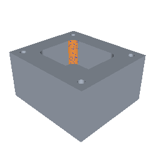
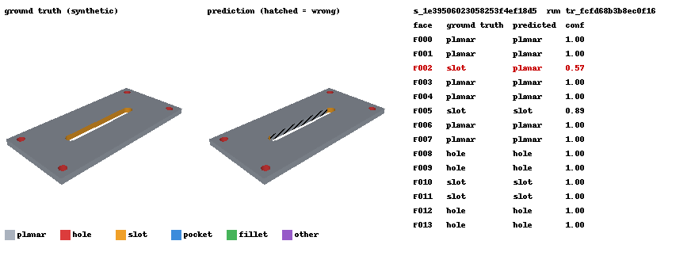

# CAD2ML

**CAD2ML converts CAD models into aligned B-Rep graphs, surface point clouds, multi-view geometric observations,
engineering-feature labels and reproducible datasets while preserving entity-level correspondence with the source
model.**

It's a local-first data engine. A STEP upload becomes an asynchronous job. The job produces a validated canonical B-Rep
and a set of aligned ML representations, and those feed a versioned, leakage-checked dataset and a baseline face
classifier. Every point, triangle, pixel, graph node and prediction can be traced back to a B-Rep face, and from
there to the source file and the pipeline version.

> Status: releases R0–R5 are verified natively (Windows 11) and in Docker Compose (PostgreSQL + Valkey + 2
> workers on Linux); 72 tests pass in both. R6 (real-world CAD) is in progress: 32 of 33 NIST industrial STEP files
> process, and the failures it exposed are fixed and documented in [docs/r6_real_world.md](docs/r6_real_world.md).
> See [STATUS.md](STATUS.md).

---

## Why CAD data is hard for ML

* **B-Rep is a graph of trimmed parametric surfaces, not a tensor.** Face counts vary per part, and adjacency and
  convexity carry the meaning.
* **Kernel traversal order is arbitrary.** Naive "face 17" labels are not reproducible.
* **Representations drift apart.** Meshes, point clouds and renders are usually generated independently, so a label
  on one can't be moved onto another.
* **STEP stores final geometry, not design intent.** Features have to be *inferred*, and that inference must be kept
  separate from what was *observed*.
* **Leakage is easy.** Random file-level splits put near-identical variants of the same design in train and test.
* **CAD input is untrusted native-code input.** Parsers hang, crash and accept invalid solids.

## What was built

```text
STEP upload ─► intake (size, extension, ISO-10303-21 sniff, sha256) ─► durable job (PostgreSQL) ─► Valkey
  └─► worker ─► isolated child: parse (timeout, assembly/multi-body policy, units → mm)
             └─► isolated child: validate + recorded repair ─► canonical faces/edges (F###/E###)
                   ─► tessellation ─► surface point cloud ─► face-adjacency graph ─► 6 views
                   ─► rule-based features with evidence ─► output invariant checks ─► atomic promote
  ─► dataset builder (ground-truth labels, dedupe, family-aware split, leakage check, content id)
  ─► GNN / MLP training jobs ─► predictions keyed by (sample_id, face_id)
```

Architecture details, the artifact table and the state machine are in [docs/architecture.md](docs/architecture.md).

## Entity lineage (real output)

From `docs/evidence/trace_example.json`, produced by `cad2ml trace` / `GET /v1/samples/{id}/faces/{face}/trace`:

```text
points 3704-3739                      (pointcloud.npz, 36 points, face_ids == 15 verified)
→ triangles 692-709                   (mesh.npz, tri_face_index == 15 verified)
→ 617 mask pixels in view 0           (views.npz face_id == 16 verified)
→ graph node 15, neighbours 1,4,6,7   (graph.npz, equal to B-Rep adjacency, verified)
→ canonical B-Rep face F015           cylinder, r = 6.0 mm, concave, 90° span        [observed/computed]
→ feature P001 pocket, conf 0.95      rule deterministic_rule_v1, 3/3 checks passed   [inferred]
→ source housing__blind_holes__22003.step  sha256 85f95925…
→ pipeline 1.1.0 · config 3e6d22c8bd2f5b8b · schema 1.0.0
```



The lineage index is data, not documentation. `trace_face` recomputes each link from the stored arrays, and the
inspector UI shows `all verified` only when all 6 checks pass.

## Supported scope (v1)

| Supported | Rejected or quarantined (explicit codes) |
|---|---|
| STEP (AP203/AP214) single-solid parts | assemblies → `UNSUPPORTED_ASSEMBLY` |
| unit detection, normalization to mm | multiple solids in one product → `MULTI_BODY` |
| BRepCheck validity, closed shell, orientation | open shells / surface models → `NO_SOLID` (quarantined) |
| recorded repair: sewing closed face sets, ShapeFix, orientation reversal, measured deviation | repair beyond tolerance → `REPAIR_DEVIATION_EXCEEDED` |
| canonical faces/edges with analytic params, curvature, convexity, fingerprints | empty, wrong extension, non-STEP content, parse failure, timeouts, child crashes |

**Explicit non-goals in v1:** voxels/SDFs, IGES or native CAD formats (the `CadAdapter` boundary exists, but no
adapters do), assemblies, and PMI. **Recovering parametric feature history from STEP is not possible and is not
attempted.** Manifests list these under `unavailable`.

Information is labelled by provenance: `observed` (read from STEP), `computed` (deterministic geometry), `inferred`
(rule-based features: separate schema fields, evidence list, confidence = 0.95 × passed/total checks),
`ground_truth` (synthetic sidecars only) and `unavailable`.

## Quick start

### Docker (target path, local-only: PostgreSQL + Valkey + filesystem volume)

```bash
cp .env.example .env
```

```bash
docker compose up --build -d
```

```bash
docker compose run --rm api python scripts/demo.py --api-url http://api:8000
```

Then open http://localhost:8000/ for the inspector. Verified on 2026-09-18: `docker compose up --build`, then the demo above ran end to end (`docs/evidence/demo_compose_run.txt`). The image is 6.23 GB and needs roughly 15 GB of free space on the Docker disk.

### Native (verified on Windows 11; no Docker needed)

```bash
powershell -ExecutionPolicy Bypass -File scripts/setup_env_windows.ps1
```

```bash
conda run -n cad2ml python scripts/dev_stack.py --data data/dev --workers 2 --port 8000
```

```bash
conda run -n cad2ml python scripts/demo.py --api-url http://127.0.0.1:8000
```

Other repeatable commands:

```bash
conda run -n cad2ml python -m cad2ml.cli generate-corpus --out fixtures/corpus --per-variant 4
```

```bash
conda run -n cad2ml python -m cad2ml.cli --data data process-corpus --corpus fixtures/corpus --report docs/evidence/corpus_report.json
```

```bash
conda run -n cad2ml python scripts/benchmark.py --local-workers 2 --report docs/evidence/benchmark_native_2workers.json
```

```bash
conda run -n cad2ml python scripts/train_baseline.py --data data --corpus fixtures/corpus
```

```bash
conda run -n cad2ml pytest
```

## API example

```bash
curl -F "file=@fixtures/corpus/parts/housing__blind_holes__22003.step" http://localhost:8000/v1/files
```

```bash
curl -X POST http://localhost:8000/v1/jobs -H "content-type: application/json" -d '{"file_id": "f_..."}'
```

```bash
curl http://localhost:8000/v1/jobs/j_.../events
```

| Endpoint | Purpose |
|---|---|
| `POST /v1/files` | upload; 422 with code for invalid input; duplicate bytes resolve to the same `file_id` |
| `POST /v1/jobs` | idempotent on `sha256 + pipeline_version + config_hash` (202 created / 200 existing) |
| `GET /v1/jobs/{id}`, `/events` | state, attempts, error code, correlation id; timestamped stage events |
| `GET /v1/samples/{id}`, `/artifacts`, `/artifacts/{name}` | schema-valid manifest; only artifacts listed in the manifest are servable |
| `GET /v1/samples/{id}/faces/{face}/trace` | verified cross-representation lineage |
| `POST /v1/datasets`, `GET /v1/datasets/{id}`, `/quality` | content-addressed dataset versions |
| `POST /v1/training-runs`, `GET /v1/training-runs/{id}`, `/predictions/{sample}` | worker-executed training and inference |
| `GET /health/live`, `/health/ready`, `/metrics` | readiness checks DB, queue and storage; Prometheus metrics |

## Dataset schema

`datasets/<ds_id>/dataset.json` records the included samples (family, design group, split), excluded samples with
reasons, the label vocabulary `planar | hole | slot | pocket | fillet | other`, the label policy, normalization, point
sampling configuration, split strategy and seed, the pipeline/schema/config versions, a hash of the label content, and a
quality report: class distribution per split, representation completeness, rejection reasons, near-duplicate
candidate clusters, the leakage check, and rule-vs-ground-truth agreement. `dataset_id` is the hash of that content, so
rebuilding from the same inputs returns the same immutable version (tested).

Ground-truth face labels come from the analytic cutting tools recorded when each synthetic part was generated. A face
is labelled when ≥95 % of its surface samples lie on a tool boundary. **The labels never come from the rule
recognizer.** Each STEP file is still processed through the same public pipeline as any upload.

Split modes: `group` holds out one design variant per family (leakage checked per design group). `family` holds out
whole families (leakage checked per family).

## Tests

72 tests. They pass natively on Windows (`pytest`, 109 s), inside the Linux container (`docker compose run --rm api pytest`, 85 s) and in GitHub Actions. The jobs/worker suite also passes against real PostgreSQL and Valkey (5/5). ruff format, ruff lint and mypy are clean. Highlights:

* **Worker hard-kill recovery:** a worker subprocess is killed mid-job, the lease expires, the reaper moves the job to
  `failed_retryable` then `queued`, and a second worker completes it on attempt 2.
* **Queue loss:** Valkey is flushed and the reconciler re-enqueues from the database. A duplicate delivery doesn't re-run the job.
* **Canonical IDs** are identical for the same solid built in different boolean orders.
* **Point/triangle/pixel ↔ face correspondence**, a 0.2 mm hole still sampled, deterministic sampling, and an invertible
  normalization (property-based).
* **No partial artifacts:** a forced extraction failure leaves only the rejection manifest and no staging directory.
* **Golden outputs** for six fixed parts, compared with tolerances and never by traversal order.

## Benchmark (measured)

83 files (72 synthetic parts + 11 failure fixtures), 2 workers, submitted over HTTP by `scripts/benchmark.py`.
Sources: `docs/evidence/benchmark_compose_2workers.json` and `docs/evidence/benchmark_native_2workers.json`.

| Metric | Docker Compose (Linux containers, PostgreSQL, Valkey) | Native (Windows 11, SQLite, fakeredis TCP) |
|---|---|---|
| outcomes | 75 completed · 7 rejected · 1 quarantined | same |
| throughput | **54.9 files/min** (90.7 s wall) | 21.0 files/min (236.9 s wall) |
| job latency, claim → terminal | p50 **2.23 s** · p95 **2.41 s** · max 7.1 s | p50 2.98 s · p95 3.30 s · max 9.3 s |
| isolated parse / extraction, p50 | 0.86 s / 1.32 s | 1.15 s / 1.79 s |
| in-child compute, p50 sum of stages | 0.40 s (views 0.24 s) | 0.61 s (views 0.28 s) |
| artifacts per sample | 544 KB mean | 549 KB mean |
| peak RSS, 2 workers incl. children | not measured (per-container limit 3 GB) | 478 MB |
| idempotent rerun of all 83 files | 0 new jobs | 0 new jobs |

The native host was shared with another heavy workload during these runs, and wall-clock throughput varied between
runs (compose ranged 41.0–54.9 files/min and native 18.3–22.7 files/min across runs on this machine). Most of each job's latency is process
isolation: spawning a child and importing OCCT happens twice per job. That's a deliberate safety trade-off
(DECISIONS D-002). A pre-forked child pool is the obvious next optimization.

## Baseline model results (measured)

Face classification on the B-Rep graph: 25 face features, 10 adjacency features, 13 global features. CPU, 150 epochs, model selected on
validation macro-F1, 3 seeds. Test metrics come from `docs/evidence/baselines.json`. GNN aggregation was chosen by
validation only (`docs/evidence/gnn_validation_sweep.json`).

| Split (test set) | Rule recognizer | Per-face MLP | GNN (3× GINE, mean aggr) |
|---|---|---|---|
| **group:** unseen design variants (12 parts, 196 faces) | 1.000 | 0.997 ± 0.005 | 0.986 ± 0.019 |
| **family:** unseen family `slotted_plate` (12 parts, 184 faces) | 1.000 | 0.971 ± 0.013 | 0.917 ± 0.054 |

Accuracy is shown; macro-F1 is in the evidence file. Seed-0 GNN: on the family split, `slot` recall is 0.68 (slot walls
predicted as `planar`); on the group split, `planar` recall is 0.92. All other classes have recall 1.0.
**The GNN is sensitive to data order.** Across reruns on byte-identical geometry whose only difference was sample ids
(which reorder the data), the GNN measured 0.934–0.986 (group) and 0.917–0.953 (family). The same seed also differs
between Windows and Linux. The MLP stayed within 0.971–1.000.

**How to read this honestly:**
* On this synthetic, prismatic corpus the **graph model does not beat a per-face MLP**. Local face descriptors
  (surface type, concavity, radius, edge convexity fractions) already separate the classes.
* The rule recognizer scores 1.000 because it was built on these families. That shows the labels and rules agree.
  It says nothing about performance on real CAD.
* Test sets are small (12 parts) and not every class appears in every split. Treat the numbers as proof that the
  dataset is usable, not as a benchmark.



## Failure handling example

From `docs/evidence/demo_native_run.txt`:

```text
empty.step                          upload rejected: EMPTY_FILE
png_renamed.step                    upload rejected: NOT_STEP_CONTENT
wrong_extension.txt                 upload rejected: UNSUPPORTED_EXTENSION
duplicate_of_part.step              completed      (idempotent: existing job)
compound_exported_as_assembly.step  rejected     UNSUPPORTED_ASSEMBLY
assembly_two_parts.step             rejected     UNSUPPORTED_ASSEMBLY
corrupt_truncated.step              rejected     STEP_PARSE_FAILED
multi_body.step                     rejected     MULTI_BODY
open_shell.step                     quarantined  NO_SOLID
tiny_feature_hole_0p2mm.step        completed
large_plate_196_holes.step          completed
```

Timeouts (`PARSER_TIMEOUT`) and native crashes (`CHILD_CRASHED`) are classified on the job and written to
`quarantine/`. They aren't cached as the sample's permanent outcome.

Two failures during development were real, and the isolation and evaluation layers caught both:
* A multithreaded OpenBLAS crash in 2 of 72 child processes surfaced as `CHILD_CRASHED` and did not take down the worker.
* A synthetic generator bug (a cap cylinder poking below the base) was caught by comparing extracted bounding boxes
  with ground truth.

Both are recorded in DECISIONS.md (D-009, D-013).

## Security and isolation (concrete measures, not certification)

Size limit (50 MB default); extension allowlist; content sniffing; filenames sanitized and never used for paths
(storage is keyed by sha256); key validation plus root containment against path traversal; kernel work runs in
spawned children with a hard timeout (plus `RLIMIT_AS`/`RLIMIT_CPU` on Linux); temp directories are removed in
`finally`; only manifest-listed artifacts can be downloaded; fault-injection hooks require
`CAD2ML_ENABLE_FAULT_INJECTION=true`; secrets come from environment variables; containers run as the non-root
`mambauser`; CI runs pip-audit and a Trivy image scan (informational).

## Repository structure

```text
apps/api            FastAPI app + static inspector UI
apps/worker         worker: claim, heartbeat, reaper, reconciler, training jobs
cad2ml/ingestion    intake checks and hashing
cad2ml/parsers      STEP adapter, isolated child runner
cad2ml/geometry     OCP helpers, validation and repair
cad2ml/topology     canonical IDs, fingerprints, face/edge extraction
cad2ml/representations  mesh, point cloud, face graph, rasterizer
cad2ml/semantics    rule-based recognizer (observations vs inferences)
cad2ml/synthetic    part families, analytic tools, ground-truth labels, corpus + failure fixtures
cad2ml/datasets     dataset builder, splits, quality
cad2ml/training     PyG data loading, GNN/MLP, deterministic training, inference
cad2ml/evaluation   metrics, recognizer evaluation, visual evidence
cad2ml/jobs         state machine, DB models, queue, job service
cad2ml/storage      ArtifactStore protocol + LocalFSStore (S3 can implement the same protocol)
cad2ml/observability  structured logs, Prometheus metrics
db/migrations       Alembic
schemas/            exported JSON Schemas (drift-tested)
scripts/            spike, benchmark, demo, baselines, dev stack, golden update
tests/              unit · geometry · integration · golden
docs/               architecture, evidence (raw measured outputs), images
```

## Limitations

* The container image is large (6.23 GB: CadQuery/VTK + PyTorch). Peak memory inside compose isn't measured yet.
* Child resource limits: `RLIMIT_AS` is only a runaway guard (see D-015). Real memory bounds come from container limits, and Windows only has the timeout.
* Real-world evaluation so far covers 11 NIST parts (33 exports) for robustness and cross-export consistency, with no
  hole-by-hole ground truth yet. 15 % of real faces remain `unknown` (cones, spheres, tori, B-splines). See
  [docs/r6_real_world.md](docs/r6_real_world.md).
* The recognizer covers a limited vocabulary and is tuned on the same families it is evaluated on.
* Canonical IDs are deterministic for a given B-Rep, but **not** stable across edits or across different STEP
  exporters, which split surfaces differently (0/11 NIST parts had identical IDs across exports; D-017).
* The GNN is not better than a per-face MLP on this data.

## Real-world evaluation (R6, in progress)

The NIST MBE PMI test models (public domain; 33 STEP files for 11 industrial parts exported by several CAD
systems) broke assumptions the synthetic corpus never tested. The first run completed only **6/33** files:
* a batch command ignored `.stp`;
* PMI curves and reference surfaces next to the solid crashed or quarantined 26 files;
* a tessellated AP242 file crashed a child process.

After the fixes (pipeline 1.1.0), **32/33 complete** and the tessellated file is rejected with an explicit code.

| Measure (after fixes) | Result |
|---|---|
| auxiliary PMI/reference geometry isolated and reported | 27 / 32 files |
| volume agreement across exports of the same part | 10 / 11 parts within 0.1 % |
| hole count identical across exports | 9 / 11 parts (was 4 before multi-face floors and counterbore handling) |
| canonical face IDs identical across exports | **0 / 11** (exporters split faces differently) |
| near-duplicate detection of same-part exports | 31/31 pairs, 0 false matches (tolerances fit on this data) |
| faces left `unknown` | 15.3 % |

Details, caveats and open items: [docs/r6_real_world.md](docs/r6_real_world.md).

## Roadmap

See [ROADMAP.md](ROADMAP.md). Next: finish R6 with a hole-by-hole audit against the NIST drawings / AP242 semantic PMI,
then the Fusion 360 Gallery segmentation subset for real per-face labels at scale.
