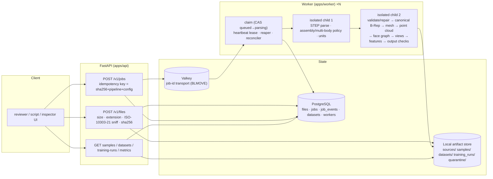

# Architecture



## Sample identity and immutability

```
sample_id = "s_" + sha256(source_sha256 | pipeline_version | configuration_hash | schema_version)[:24]
```

* `sources/<aa>/<sha>.step` — write-once uploaded bytes
* `staging/<sample>-<rand>/` — artifacts written, validated, then moved atomically to `samples/<sample>/`
* `samples/<sample>/manifest.json` — written last; schema: `schemas/manifest.schema.json`
* `datasets/<dataset_id>/` — content-addressed; never overwritten
* `quarantine/<sample>/<timestamp>-<code>.json` — timeouts/crashes (not cached as the sample outcome)

## Per-sample artifacts

| artifact | content | correspondence key |
|---|---|---|
| `canonical.brep` | validated (repaired only if recorded) OCCT B-Rep, mm | — |
| `brep.json` | face and edge records (`F###`, `E###`) | canonical IDs |
| `graph.npz` | `face_features [F,25]`, `edge_index [2,A]`, `adjacency_features [A,10]`, `global_features [13]`, `node_face_ids` | node i = face i |
| `pointcloud.npz` | `points` (normalized), `points_mm`, `normals`, `face_ids`, `curvature`, `face_point_range`, `center`, `scale` | `face_ids[k]` |
| `mesh.npz` | `vertices`, `vertex_normals`, `triangles`, `tri_face_index`, `face_tri_range` | `tri_face_index[t]` |
| `views.npz` + PNGs | depth, normals, `face_id` (0 = background, k+1 = face k), shaded RGB | mask value |
| `cameras.json` | world→camera 4×4, pinhole intrinsics | — |
| `features.json` | `observations` (computed) and `features` (inferred, with evidence) | participating faces |
| `lineage.json` | face → graph node, point range, triangle range, pixels per view, feature ids | canonical face ID |

## Job state machine

```
received → validated → queued → parsing → normalizing → extracting → validating_outputs → completed
queued → training → completed                                           (training jobs)
any in-flight → rejected | quarantined | timed_out | failed_terminal | failed_retryable
failed_retryable → queued (attempts < max) | failed_terminal
```

Transitions are enforced in `cad2ml/jobs/states.py` and applied with compare-and-set updates that also write
a `job_events` row.
